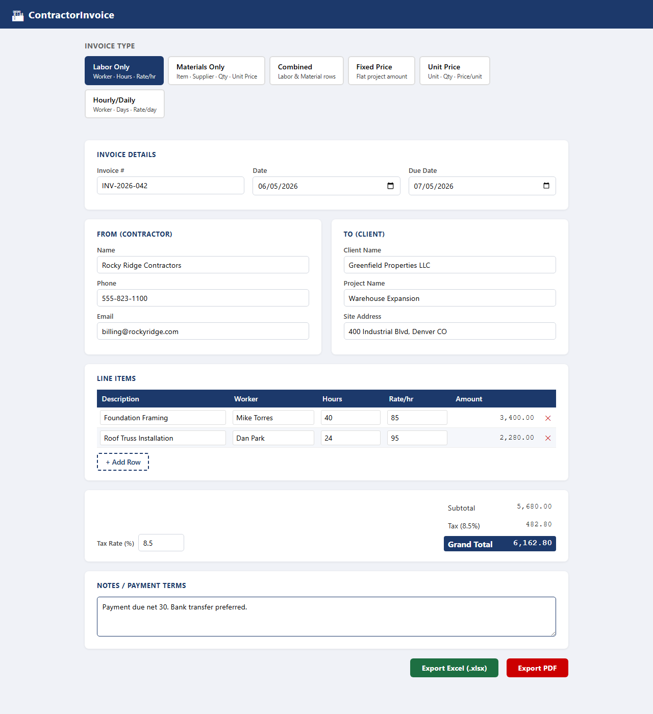
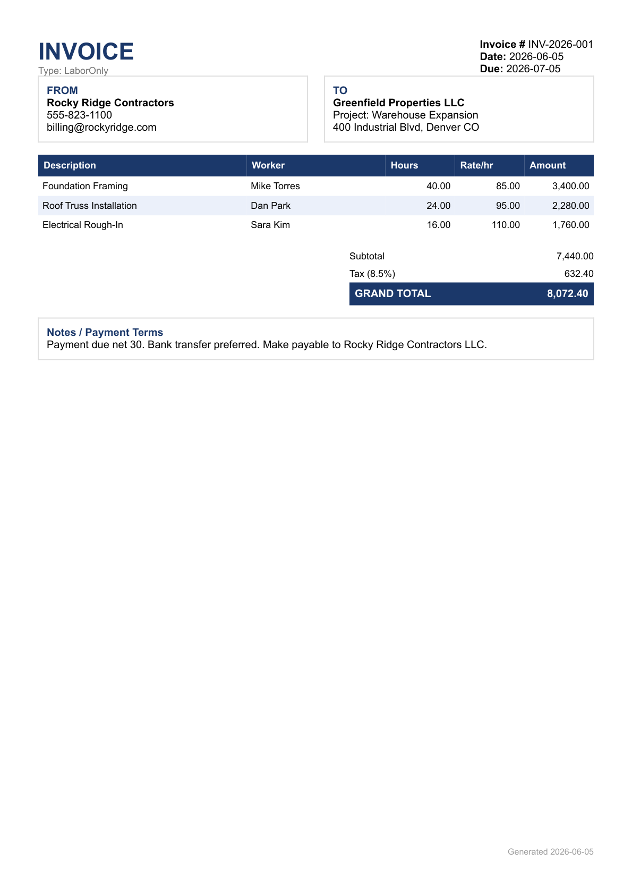

# ContractorInvoice

A full-stack invoice generation system for construction contractors. Fill in job details, add line items, and export professional invoices as **Excel (.xlsx)** or **PDF** — no login required.



| Form | Exported PDF |
|---|---|
|  |  |

---

## Stack

| Layer | Technology |
|---|---|
| Frontend | Angular 18 (standalone components, reactive forms) |
| Backend | .NET 8 Web API |
| Excel export | EPPlus 7 |
| PDF export | QuestPDF 2025 |
| Styling | Pure CSS (no UI framework) |

---

## Features

### 6 Invoice Types
Each type changes the line-items table columns dynamically:

| Type | Columns |
|---|---|
| **Labor Only** | Description · Worker · Hours · Rate/hr · Amount |
| **Materials Only** | Item · Supplier · Qty · Unit Price · Amount |
| **Combined** | Description · Type (Labor/Material) · Qty · Rate · Amount |
| **Fixed Price** | Project Description · Amount |
| **Unit Price** | Description · Unit · Qty · Price/unit · Amount |
| **Hourly/Daily** | Description · Worker · Days · Rate/day · Amount |

### Invoice Form
- Invoice number, date, due date
- Contractor (From) and Client (To) info panels
- Dynamic line items — add/remove rows, amounts auto-calculate (`Qty × Rate`)
- Tax rate input with live **Subtotal → Tax → Grand Total** calculation
- Notes / payment terms textarea
- No login required

### Exports
- `POST /api/invoice/export/excel` → `.xlsx` file
- `POST /api/invoice/export/pdf` → `.pdf` file
- Both accept the same JSON body; layouts mirror each other

---

## Quick Start

### Prerequisites
- [.NET 8 SDK](https://dotnet.microsoft.com/download)
- [Node.js 20+](https://nodejs.org/)

### Run (both servers)

Double-click **`start-dev.bat`** — it opens two terminals and starts both servers.

Or manually:

```bash
# Terminal 1 — API
cd InvoiceApi
dotnet run --urls http://localhost:5000

# Terminal 2 — Angular
cd invoice-app
npx @angular/cli@18 serve
```

Open **http://localhost:4200** in your browser.

---

## Project Structure

```
InvoiceAutomation/
├── start-dev.bat                   # One-click dev launcher
│
├── InvoiceApi/                     # .NET 8 Web API  (port 5000)
│   ├── Controllers/
│   │   └── InvoiceController.cs    # POST /api/invoice/export/{excel|pdf}
│   ├── Models/
│   │   └── InvoiceDto.cs           # InvoiceDto, LineItemDto, ContractorInfo, ClientInfo
│   ├── Services/
│   │   ├── ExcelExportService.cs   # EPPlus workbook builder
│   │   └── PdfExportService.cs     # QuestPDF document builder
│   └── Program.cs                  # CORS + DI wiring
│
└── invoice-app/                    # Angular 18  (port 4200)
    └── src/app/
        ├── models/
        │   └── invoice.models.ts   # TypeScript interfaces + INVOICE_TYPE_COLUMNS map
        ├── services/
        │   └── invoice-export.service.ts   # HTTP POST → browser file download
        └── invoice/
            ├── invoice-shell/              # Page wrapper + header bar
            ├── invoice-type-selector/      # 6-type toggle grid
            ├── invoice-form/               # Reactive form, assembles InvoiceDto
            ├── line-items-table/           # Dynamic rows, Qty×Rate auto-calc
            └── invoice-totals/             # Subtotal / Tax / Grand Total display
```

---

## API Reference

### `POST /api/invoice/export/excel`
### `POST /api/invoice/export/pdf`

Both endpoints accept the same JSON body and return a file download.

**Request body:**

```json
{
  "invoiceNumber": "INV-2026-001",
  "date": "2026-06-05",
  "dueDate": "2026-07-05",
  "invoiceType": "LaborOnly",
  "from": {
    "name": "Rocky Ridge Contractors",
    "phone": "555-823-1100",
    "email": "billing@rockyridge.com"
  },
  "to": {
    "name": "Greenfield Properties LLC",
    "projectName": "Warehouse Expansion",
    "siteAddress": "400 Industrial Blvd, Denver CO"
  },
  "lines": [
    {
      "description": "Foundation Framing",
      "worker": "Mike Torres",
      "qty": 40,
      "rate": 85,
      "amount": 3400
    }
  ],
  "taxRate": 8.5,
  "notes": "Payment due net 30."
}
```

**Invoice types:** `LaborOnly` · `MaterialsOnly` · `Combined` · `FixedPrice` · `UnitPrice` · `HourlyDaily`

---

## Excel Layout

- Row 1: INVOICE title (merged, branded color)
- Rows 2–3: Invoice number / date / type / due date
- Rows 5–8: FROM (contractor) and TO (client) info blocks
- Row 10: Column headers (frozen, white-on-navy)
- Rows 11+: Line items with alternating row shading
- Totals block: Subtotal → Tax → **Grand Total** (bold, navy background)
- Notes box at bottom (merged, wrap text)
- Auto-fit columns

## PDF Layout

- Two-column header: INVOICE title (left) · Invoice # / Date / Due (right)
- FROM ↔ TO panels side by side
- Line items table with alternating row shading and right-aligned numbers
- Right-aligned totals block: Subtotal · Tax · **Grand Total** (white on navy)
- Notes box at the bottom

---

## Out of Scope (MVP)

- User authentication
- Invoice storage / history
- Email sending
- Signature capture
